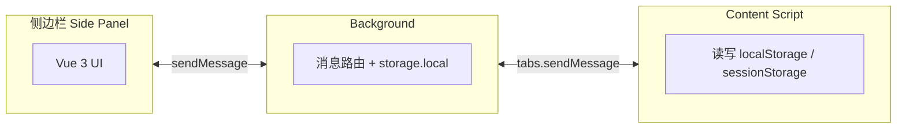

# 多工具助手

一款基于 WXT + Vue 3 的浏览器扩展，集合多种实用工具。当前包含**缓存助手**：指定并缓存页面的 `localStorage` / `sessionStorage` 字段，便于切换账号或验证不同缓存数据场景。

## 技术栈

| 技术                   | 用途                                |
| ---------------------- | ----------------------------------- |
| [WXT](https://wxt.dev) | 扩展构建框架，支持 Chrome / Firefox |
| Vue 3                  | 侧边栏 UI 框架                      |
| TypeScript             | 类型安全                            |
| Element Plus           | UI 组件库                           |
| UnoCSS                 | 原子化 CSS                          |
| Vue Router             | 侧边栏路由                          |
| VueUse                 | 组合式工具函数                      |

## 项目结构

```
multiToolAssistant/
├── src/
│   ├── entrypoints/          # 入口脚本
│   │   ├── background.ts     # 后台 Service Worker
│   │   ├── content.ts        # 内容脚本（注入网页）
│   │   └── sidepanel/        # 侧边栏页面
│   ├── components/           # 可复用组件
│   ├── layouts/              # 布局组件
│   ├── router/               # 路由配置
│   ├── styles/               # 全局样式
│   ├── types/                # 类型定义
│   ├── utils/                # 工具函数
│   └── views/                # 页面视图
├── public/                   # 静态资源
├── scripts/                  # 构建脚本
├── wxt.config.ts             # WXT 配置
└── uno.config.ts             # UnoCSS 配置
```

## 快速开始

### 环境要求

- Node.js 18+
- pnpm（推荐）

### 安装

```bash
pnpm install
```

### 开发

```bash
# Chrome
pnpm dev

# Firefox
pnpm dev:firefox
```

### 构建

```bash
# Chrome
pnpm build

# Firefox
pnpm build:firefox
```

### 打包

```bash
# 生成 zip（用于商店上架）
pnpm zip

# 生成 .crx（Chrome 本地安装）
pnpm crx
```

## 架构说明



- **侧边栏**：用户操作入口，通过 `browser.runtime.sendMessage` 与 background 通信
- **Background**：消息分发、持久化存储、标签页切换时通知侧边栏刷新
- **Content Script**：在页面上下文中读写 `localStorage` / `sessionStorage`，由 background 通过 `tabs.sendMessage` 调用

## 扩展权限

| 权限                               | 用途                             |
| ---------------------------------- | -------------------------------- |
| `storage`                          | 持久化监听字段与配置             |
| `activeTab` / `scripting` / `tabs` | 与 content script 通信，注入脚本 |
| `sidePanel`                        | 侧边栏入口                       |
| `host_permissions: <all_urls>`     | 可注入任意页面读取 storage       |

## 新增工具

1. 在 `src/router/index.ts` 的 `toolRoutes` 中注册路由
2. 在 `src/views/tools/` 下创建工具页面
3. background 中按需添加消息处理逻辑

## 相关文档

- [功能说明](./功能说明.md) - 功能详解与使用说明
- [WXT 文档](https://wxt.dev)
- [Chrome Extension Manifest V3](https://developer.chrome.com/docs/extensions/mv3/)
